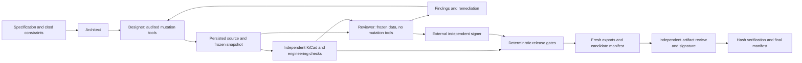

# Architecture and trust boundaries

The target lifecycle is SPEC → ARCHITECTURE → COMPONENT_SELECTION → SCHEMATIC →
SCHEMATIC_REVIEW → FLOORPLAN → CRITICAL_ROUTING → GENERAL_ROUTING → PCB_REVIEW → DFM →
MECHANICAL → RELEASE_REVIEW → RELEASED. PCB_REVIEW includes power/return-path review;
RELEASE_REVIEW includes Gerber inspection. The lifecycle state machine enforces ordered gates and invalidates prior evidence when inputs change.

Architect decomposes requirements, power/signal/clock trees and risks. Designer owns source
mutations via a selectable KiCad MCP implementation. Reviewer tries to invalidate a frozen
snapshot using read-only design/evidence access. Release tooling evaluates deterministic
checks and revision-bound independent approvals. No generative result is verification.

## Boundaries
MCP config is an application contract, not a directly installable Codex MCP file. A future
harness must map explicitly audited tools to READ/WRITE capabilities, deny unknown tools,
and refuse startup when reviewer isolation cannot be enforced. Reviewer allowlists are
empty by default. Do not give reviewer the designer server, generic shell, scripting,
filesystem-write or MCP passthrough tools. Read-only source mounts and separate credentials
are required beyond prompt policy. IPC access is optional behind the same adapter boundary.
M1 adds an audited stdio client and a separate snapshot-only reviewer surface;
no multi-agent model runtime is implemented yet.

## Verification semantics
CheckStatus describes execution/conclusion; severity describes engineering impact. PASS,
FAIL, WARN, SKIP and ERROR remain distinct in input reports. Exit codes: 0 all PASS;
1 failure/error or empty report; 2 warnings/skips only. Gate evaluation requires every
mandatory automated check to PASS; WARN/SKIP/missing also block. Manual gates require Ed25519-signed, revision-bound independent approvals.
Waivers require an explicitly trusted human signer and per-gate permission (disabled by
default). Private signing keys are external to agent tools; see foundation.md. An imported JSON PASS is untrusted aggregation input, not release proof.

KiCad checks capture exit status/output/artifacts, refuse existing export targets and never
turn missing executables into success. JSON violations, exclusions and warnings retain their
status. Saved native snapshots retain content hashes. ngspice executes bounded self-contained
netlists with scalar assertions; external model/include qualification remains incomplete.
BOM checks establish declared integrity. Public JLCSearch and Adafruit lookups add sourcing
observations without establishing engineering suitability or committing a purchase.

## Evidence and release
Snapshots and release identities bind source/library/model/config hashes and dirty contents
to a Git revision. Every mutation invalidates affected evidence. The implemented release
coordinator runs checks, exports into a fresh directory, validates artifacts, and produces a
candidate manifest. Finalization requires separate signed reviews of the exact artifact
manifest. The example has no populated native board and cannot be released.

See [capabilities](capabilities.md) for implemented versus unqualified operations and
[issue acceptance audit](issue-acceptance.md) for remaining acceptance criteria. Python tool
facades are not an OS sandbox: deployment isolation and live model transport remain open.

## Sources checked during initialization
- [KiCad 10 CLI](https://docs.kicad.org/10.0/en/cli/cli.html): command syntax reference.
- [GPT-6 Astra](https://developers.openai.com/api/docs/models/gpt-6-astra): target model;
  deployment access and harness support must be established locally. No model calls here.
